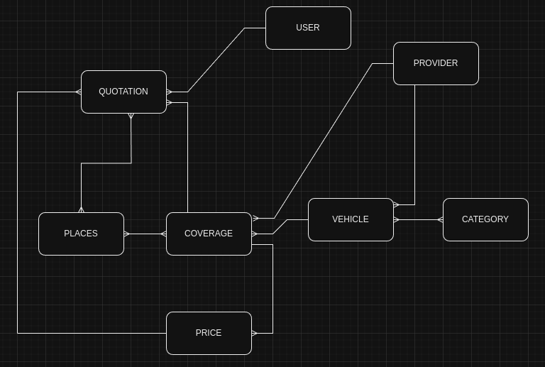

# Backend Test Envíame

La siguiente prueba requiere realizar el diseño y desarrollo de un microservicio de cotización de viajes.

El proyecto está enfocado en resolver un sistema de cotización de viajes, por lo tanto **debes descartar procesos relacionados a pago y facturación**.

### Requerimientos técnicos

- Deberás elegir entre uno de los siguientes lenguajes + frameworks para desarrollar tu solución:
  - Python + Flask
  - NodeJS + Express
- Deberás utilizar Docker / docker-compose para proveer una aplicación Dockerizada.
- La API desarrollada deberá considerar algún mecanismo de autenticación como: API Key, Bearer Token, Basic Auth, OAuth.

Si no estás familiarizado con Docker, hemos compartido un template para Python y NodeJS, el que ha sido estructurado siguiendo los principios definidos por [Clean Architecture](https://www.google.com/search?q=clean+architecture). Te alentamos a que uses la plantilla provista y te recompensaremos con puntos adicionales por las siguientes dos razones:

- Leer y entender el código escrito por otro desarrollador es una habilidad necesaria y que valoramos.
- Es deseable la comprensión de los principios de Clean Architecture.

La plantilla proporciona bases de datos MySQL, Firestore y Redis listas para usar. Siéntente libre de usar cualquiera de estas herramientas o cualquier combinación de ellas.

### Plazo

Debes entregar la prueba en 72 horas (3 días).

### Antes de comenzar

Entrega un **repositorio privado de GitHub** con tu código y agrega a los siguientes usuarios como colaboradores: **@rolivagon @rsebjara @vmolina-enviame @vham @rcarrasco-enviame**.

No te olvides de incluir en tu repositorio:

- Un microservicio dockerizado. Los archivos **Dockerfile y docker-compose.yml** son necesarios y requeridos.
- Una **colección de Postman o archivo req.http** con requests de ejemplo para probar todos los endpoints de tu microservicio.
- Un archivo de variables de ambiente **(no ignorar el archivo .env)** con todos sus valores necesarios para ejecutar tu servicio sin mayor problema.
- Un archivo README.md con las instrucciones sobre cómo ejecutar tu servicio en nuestros ambientes locales, además de otra información que consideres relevante para facilitar nuestra revisión.
- Un método para poblar automáticamente la base de datos con datos de prueba.

Por favor, antes de entregar tu prueba, asegúrate de probar tu servicio en un ambiente limpio desde el inicio. Con esto te asegurarás de probar en similares condiciones que las que tendrá nuestro equipo Dev para revisar tu prueba. **Si no podemos ejecutar tu servicio, tu prueba será descartada inmediatamente**.

Dado que se trata de una prueba de backend, concéntrate en entregar una API donde podamos probar todas las funcionalidades requeridas (he aquí la importancia de la colección de Postman o http.req). **No es necesario que desarrolles ninguna vista de frontend, ya que tampoco serán evaluadas**.

En caso de cualquier pregunta técnica, [contáctanos aquí](mailto:tech-test@enviame.io).

Una vez comenzada la revisión de tu prueba podríamos enviarte algunas preguntas. por lo que apreciaremos tus respuestas oportunas.

### Requerimiento

1. Desarrolle un microservicio (ms, de ahora en adelante) de cotización de viajes en bus, basándose en el siguiente modelo 
2. En el sistema deben existir las siguientes entidades:
   - usuarios: **USER**, donde se individualiza al usuario que realiza la cotización.
   - lugares de origen o destino: **PLACES**, donde se almacena el listado de posibles lugares de origen o destino.
   - categorías de viaje: **CATEGORY**, donde se almacenan valores asociados a confort y calidad como por ejemplo "standard" y  "premium".
   - proveedores del servicio: **PROVIDER**, donde se almacena el nombre del proveedor del servicio como por ejemplo "PULLMAN BUS" o "TURBUS".
   - vehiculo: **VEHICLE**, que contiene un nombre e indentificador de vehículo, así como la capacidad de pasajeros asociados a una categoría de viaje. ej.: Bus dos pisos, capacidad 40 pasajeros standar y 8 pasajeros premium.
   - Cobertura geográfica: **COVERAGE**, donde se almacena los trayectos origen-destino para proveedor y vehículo determinado, así como la hora de inicio y duración del viaje en horas.     
   - Precios: **PRICE**, donde se almacenan los precios para una determinada combinación de cobertura y rango de fechas determinado. Es decir, los precios deben considerar un periodo de vigencia.
   - Cotización: **QUOTATION**, donde se almacenan las cotizaciones realizadas por un usuario determinado, y que considera categoría, origen, destino, fecha, cantidad de pasajeros. Además, una cotización puede tener los estados "creada", "reserva" y "reserva cancelada". Adicionalmente, las cotizaciones en "reserva" tienen una cobertura asociada y un precio de esa cobertura asociado a la fecha.
3. En el sistema se deben implementar las siguientes reglas de negocio:
    - Un USER puede crear una cotizacion indicando indicando como parámetros:
        - Origen
        - Destino
        - Fecha de viaje
        - Cantidad de pasajeros

        y opcionalmente puede agregar el parámetro:
        - Categoría
          
        La cotización inicialmente queda en estado "creada", retornando un ID de cotización único y además retorna un listado de coberturas con precios asociados (idealmente el listado entrega ID de Cobertura, ID de precio, junto con el monto/valor $ y vehículo), en base al origen-destino y la fecha del viaje de la cotización.
   - Un USER puede cambiar el estado de una cotización **(QUOTATION)** indicando como parámetros: 
        - id de cotización
        - estado de la cotización: "reserva" o "reserva cancelada".
        - para cambiar una cotización a "reserva", se debe asociar la cotización a una cobertura y precio, agregándole un ID de Cobertura, un ID Precio, asociado a la fecha, y cambiando el estado a "reserva".        
        - además, al momento de cambiar a estado "reserva" se debe verificar si existe capacidad para realizar la reserva, en función de la capacidad del/los vehículos asociados a la cobertura y otras reservas ya realizadas.
    - Otras consideraciones: 
        - Debe implementar validación de cambio de estado: desde "creado" solo se puede pasar a "reserva" y desde "reserva" solo se puede cambiar estado a "reserva cancelada". "reserva cancelada" es un estado final.
4. Desarrolle una API que implemente la lógica anterior y que además cumpla con los siguiente:
   - CRUD de USER, PLACE, VEHICLE, CATEGORY, PROVIDER, COVERAGE, PRICE, QUOTATION.
   - Listado de QUOTATION por: USER o PROVIDER.
   - Listado de QUOTATION dentro de un rango de fechas.

### Aspectos a evaluar

Como se mencionó antes, es importante que escribas un archivo README.md con toda las instrucciones necesarias para ejecutar tu servicio, y una colección de Postman o un archivo req.http con ejemplos e instrucciones para probar tu API adecuadamente. **Si el README.md está incompleto y/o no proporcionas una colección de Postman o archivo req.http no podremos probar tu servicio, y por tanto no podremos evaluar tu prueba**.

- Funcionalidad (45 pts)
- Documentación (7 pts)
  - README.md
  - Colección de Postman o archivo req.http
- Estilo de programación (6 pts)
- Uso apropiado de respuestas HTTP (4 pts)
- Manejo adecuado de errores y excepciones (4 pts)
- Uso apropiado del template de Clean Architecture (4 pts)

### Aspectos que serán ignorados

- Diseño visual de la solución (frontend).
- Despliegue de la solución (despliegues en Heroku, Linode, AWS o similares no suman puntos).
